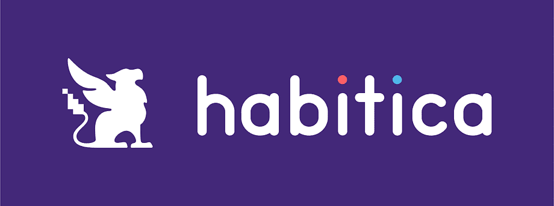
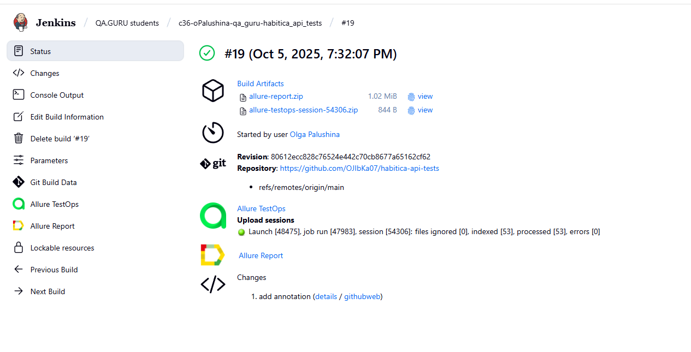
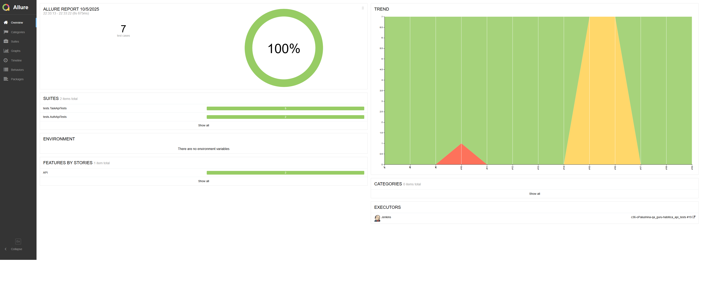
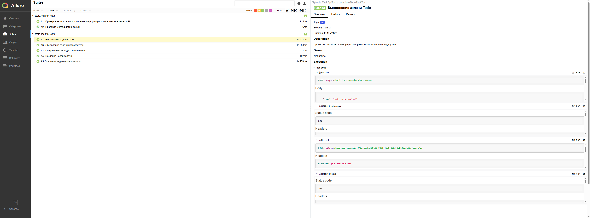
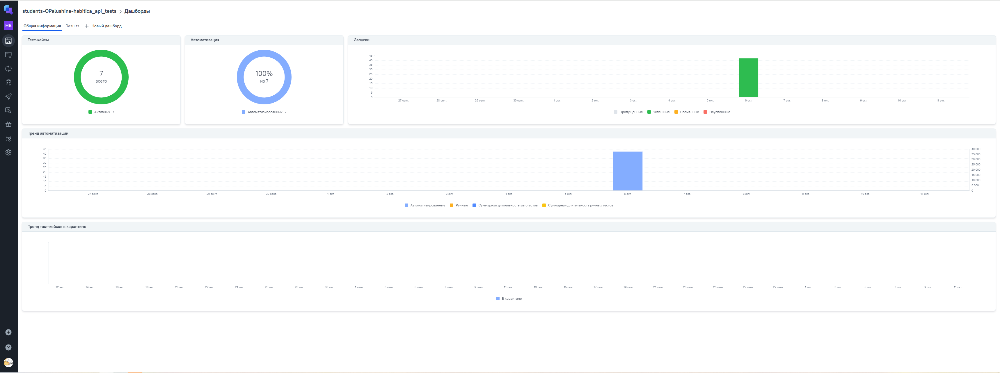
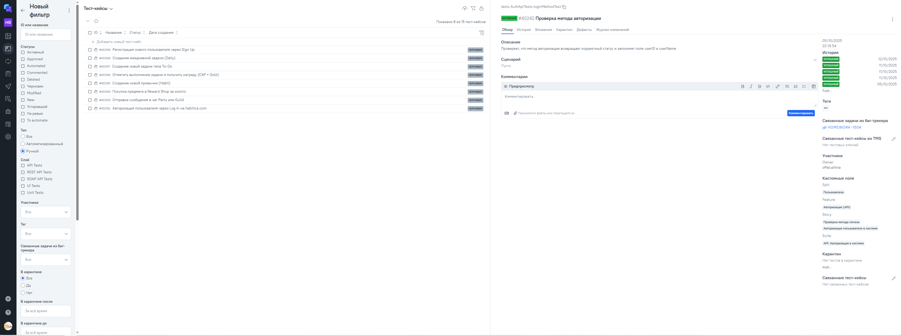
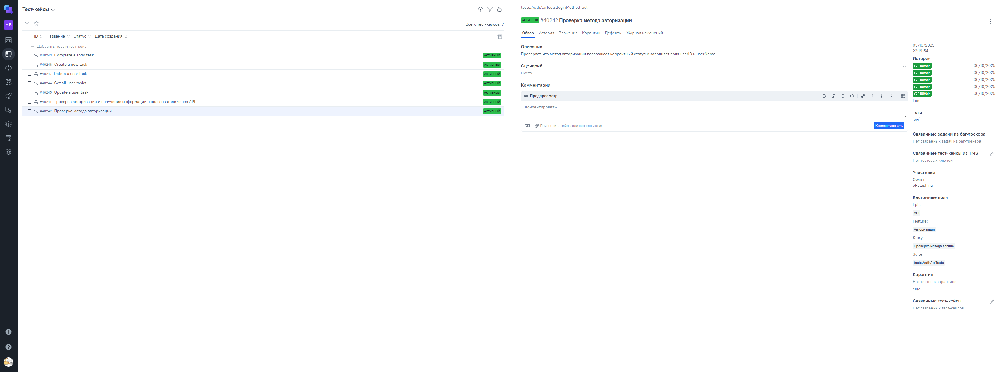
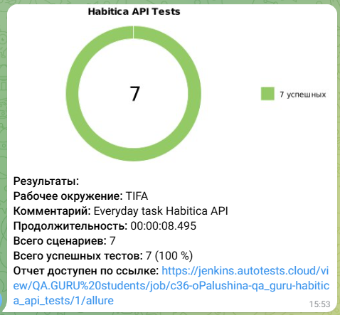

# Проект автоматизации тестирования API [HABITICA](https://habitica.com/)
<p align="center">  </p>

## **Содержание:** ##

* <a href="#description">Описание</a>

* <a href="#tools">Технологии и инструменты</a>

* <a href="#cases">Пример проверок по автоматизации</a>

* <a href="#jenkins">Сборка в Jenkins</a>

* <a href="#console">Локальный запуск</a>

* <a href="#allure">Allure отчет</a>

* <a href="#testops">Интеграция с Allure TestOps</a>

* <a href="#jira">Интеграция с Jira</a>

* <a href="#telegram">Отправка результатов в Telegram-бота</a>

-----
<a id="description"></a>
## <a name="Описание">**Описание:**</a>
## 🧙‍♂️ Habitica — преврати свои задачи в игру!

**[Habitica](https://habitica.com)** — это бесплатное приложение для управления задачами и формирования привычек, которое превращает твою повседневную жизнь в ролевую игру (RPG). Выполняй задачи, прокачивай персонажа, получай награды и сражайся с монстрами вместе с друзьями.

- ✅ Создавай и отслеживай привычки, задачи и цели
- 🎮 Получай очки опыта и золото за выполнение дел
- 🧑‍🤝‍🧑 Объединяйся с друзьями в гильдии и участвуйте в квестах
- 🏆 Становись лучше каждый день, играя в жизнь

<a id="tools"></a>
## <a name="Технологии и инструменты">**Технологии и инструменты:**</a>

<p align="center">
<a href="https://www.w3schools.com/java/">  </a> 
<a href="https://www.jetbrains.com/idea/">  </a> 
<a href="https://git-scm.com/">  </a> 
<a href="https://junit.org/junit5">  </a>
<a href="https://rest-assured.io/">  </a>
<a href="https://gradle.org">  </a>
<a href="https://allurereport.org/">  </a>
<a href="https://qameta.io/">  </a>
<a href="https://www.jenkins.io">  </a>
<a href="https://www.atlassian.com/software/jira">  </a>
</p>

- Автотесты API были написаны на **Java**.
- В качестве сборщика использовался **Gradle**.
- В качестве тестовых фреймворков применялись **JUnit 5** и **REST-assured**.
- Для удалённого запуска реализована задача в **Jenkins** с генерацией **Allure-отчёта** и отправкой результатов в **Telegram** с помощью бота.
- Настроена интеграция с **Allure TestOps** и **Jira**.

----
<a id="cases"></a>
## **Примеры автоматизированных тест-кейсов**

### 🔐 Авторизация — endpoint `POST /user/login` и `GET /user`
- ✅ Проверка успешной авторизации пользователя через API
- ✅ Проверка получения информации о пользователе после авторизации
- ✅ Сопоставление данных профиля с результатами логина


### ✅ Работа с задачами (тасками)

**Создание задачи — endpoint `POST /tasks/user`**
- ✅ Проверка успешного создания новой задачи с корректными параметрами
- ✅ Проверка структуры ответа после создания задачи

**Получение задач — endpoint `GET /tasks/user`**
- ✅ Проверка, что список задач возвращается и не пуст
- ✅ Проверка формата данных в ответе сервера

**Удаление задачи — endpoint `DELETE /tasks/{id}`**
- ✅ Проверка успешного удаления задачи пользователя
- ✅ Проверка отсутствия удалённой задачи в общем списке задач

**Обновление задачи — endpoint `PUT /tasks/{id}`**
- ✅ Проверка успешного обновления текста задачи
- ✅ Проверка наличия обновлённой информации в списке задач

**Выполнение задачи Todo — endpoint `POST /tasks/{id}/score/up`**
- ✅ Проверка успешного выполнения задачи типа `Todo`
- ✅ Проверка поля `success` в ответе после выполнения задачи

----
<a id="jenkins"></a>
## Сборка в Jenkins ([link](https://jenkins.autotests.cloud/job/C24-egorovaa-apitests/))
<p align="center">  
<a href="https://jenkins.autotests.cloud/job/C24-egorovaa-apitests/"></a>  
</p>

### **Параметры запуска Jenkins:**

- `USER_ID` 
- `API_TOKEN` 
- `USERNAME`
- `BASE_PATH` 
- `BASE_URI`
- `ENVIRONMENT`
- `COMMENT`


----
<a id="console"></a>
## Run from Terminal

**Local launch**
```bash  
gradle clean test
```

**Remote launch via Jenkins**
```bash
clean test
-DuserId=${USER_ID}
-DaoiToken=${API_TOKEN}
-Dusername=${USERNAME}
-DbasePath=${BASE_PATH}
-DbaseUri=${BASE_URI}
```


----
<a id="allure"></a>
## Allure отчет ([link](https://jenkins.autotests.cloud/job/C24-egorovaa-apitests/allure/))

**Страница отчета**
<p align="center">  
<a href="https://jenkins.autotests.cloud/job/C24-egorovaa-apitests/allure/"></a>  
</p>

**Тест-кейсы**
<p align="center">  
<a href="https://jenkins.autotests.cloud/job/C24-egorovaa-apitests/allure/"></a>  
</p>


----
<a id="testops"></a>
## Интеграция Allure TestOps ([link](https://allure.autotests.cloud/project/4213/dashboards))
<p align="center">  
<a href="https://allure.autotests.cloud/project/4213/dashboards"></a>  
</p>

**Ручные тест-кейсы**
<p align="center">  
<a href="https://allure.autotests.cloud/project/4213/dashboards"></a>  
</p>

**Автоматизированные тест-кейсы**
<p align="center">  
<a href="https://allure.autotests.cloud/project/4213/dashboards"></a>  
</p>

----
<a id="jira"></a>
## Интеграция с Jira ([link](https://jira.autotests.cloud/browse/HOMEWORK-1211))
<p align="center">  
<a href="https://jira.autotests.cloud/browse/HOMEWORK-1211"></a>  
</p>

----
<a id="telegram"></a>
## Отправка результатов в Telegram-бота
<p align="center">  
 
</p>
